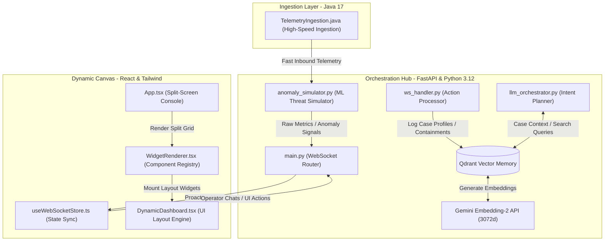

# ⚡ Q-Guardian OS — AI Security Operations Center
### HackIndia 2026 Submission — Track 04 (Stateful AI Agents with Dynamic UI)

> 🚀 **Working Live Demo**: [https://Rishini-Dharan.github.io/HackIndia2026/](https://Rishini-Dharan.github.io/HackIndia2026/)
> 
> *Experience the complete dynamic AI interface directly in your browser. The application includes a fully interactive client-side sandbox mode fallback that replicates all backend telemetry and intelligence structures!*

---

## 🎮 Jury Walkthrough Guide (How to Experience the App)

To make it as easy as possible for the judges to comprehend the full power of Q-Guardian OS, we have built a **Jury Walkthrough & Demo Guide** directly into the sidebar of the live link:

1. **Step 1: Trigger Attack** 
   - *Action*: Click `1. Trigger Attack` in the sidebar.
   - *Result*: Real-time packet telemetry spikes on the Traffic Monitor, a ransomware alert flashes, and the workspace dynamically morphs into split-screen mode to mount the **Threat Topology** and **Containment Rules** widgets.
2. **Step 2: View Triage Board**
   - *Action*: Click `2. View Triage Board`.
   - *Result*: The canvas updates to display the active Incident Triage Board listing anomalously high packets requiring review.
3. **Step 3: Check Baselines**
   - *Action*: Click `3. Check Baselines`.
   - *Result*: The AI analyzes historical baseline traffic and appends a **Baseline Comparison Cards** widget to yesterday's logs to help the operator compare peak ingress metrics.
4. **Step 4: Execute IP Isolation**
   - *Action*: Click `4. Execute IP Isolation` (or click directly on the Attacker IP bubble on the topology map and select **Block Attacker IP**!).
   - *Result*: The firewall blocks the source, the live traffic chart immediately drops to zero, and the workspace recomposes to a post-mitigation stable state.
5. **Step 5: False Positive Check**
   - *Action*: Click `5. False Positive Check`.
   - *Result*: Emulates a scenario where the operator identifies the anomaly as an admin backup. The AI replans, replaces the containment tools, and mounts the **Kerberos Authentication Log Timeline** widget.
6. **Step 6: Gen Incident Report**
   - *Action*: Click `6. Gen Incident Report`.
   - *Result*: The AI dynamically compiles all mitigation history, blocked IPs, and telemetry logs into an structured **Executive Incident Document** on the workspace.

---

## ⚡ Direct Node Interaction (Click-to-Block)
Juries do not need to navigate separate containment menus to block threat IPs. In the **Threat Topology** panel:
- **Click the red Attacker bubble** (`45.33.12.99`). 
- A premium, context-aware menu appears offering a prominent **"Block Attacker IP"** action.
- Clicking block instantly stops the telemetry simulator, drops the traffic lines on the chart, and changes the node's visual state to green/blocked (`🛡️`).
- You can click it again to **"Unblock & Restore IP"** and watch traffic resume!

---

## 1. System Architecture



---

## 3. Core Components

### 3.1 High-Performance Ingestion Layer (`telemetry-ingestion/`)

 - **Technology**: Java 17+.
 - **Architecture**: A zero-allocation, manual parsing stream engine. It bypasses heavy regular expressions, `String.split()`, and `StringTokenizer` in favor of inline index parsing (`indexOf` and `charAt`).
 - **Function**: Processes raw syslog or packet telemetry at extreme speeds with microsecond latency, preparing inputs for the machine learning models.

### 3.2 Orchestration Hub (`backend/`)

 - **WebSocket Router (`main.py` & `ws_handler.py`)**: Establishes a zero-latency bidirectional pipe between client and server, routing telemetry events, agent chats, widget controls, and operator action feedbacks.
 - **Stateful Memory Core (`qdrant_memory.py`)**:

 - Leverages **Gemini API** (`gemini-embedding-2`) to fetch 3072-dimensional semantic embeddings.
 - Automatically targets **Qdrant Cloud** and handles DNS or connection failures by falling back to a local, in-memory engine (`:memory:`).
 - Implements **Investigation Profile Schemas** that store the case ID, status (active/neutralized), evidence checklist, hypothesis, mitigation strategy, and operator notes.
 - **Intent Planner (`llm_orchestrator.py`)**: Uses Groq/OpenAI/Ollama configurations. Intercepts queries, pulls historical context from Qdrant vector memory, and emits dynamic layout commands or widget registrations to the client.

### 3.3 Dynamic Canvas UI (`frontend/`)

 - **Zustand State Store (`useWebSocketStore.ts`)**: Manages the connection loop, messages, telemetry buffers, and the active `InvestigationWorkspace` state.
 - **Split-Screen Console (`App.tsx` & `InvestigationBanner.tsx`)**:

 - If a threat case is active, the interface morphs: the left 33% hosts the AI chat and command interface, and the right 67% mounts the investigation widgets.
 - The banner renders the active hypothesis, threat score, and evidence list, updating in real-time as containment actions are applied.
 - **UI Layout Engine (`DynamicDashboard.tsx`)**: Translates structured JSON properties emitted by the AI planner into styled components (metric cards, forms, tables, and structured documents) dynamically at runtime.

---

## 4. Core Data Flows

### 4.1 Proactive Alert Flow

1. High-speed Java ingestion feeds a packet burst.
2. The ML classifier identifies ransomware behavior (e.g., SMB spikes on port 445 with 98% confidence).
3. The simulator triggers the proactive orchestration pipeline.
4. The backend broadcasts a `workspace_mount` instruction containing:

 - Case ID (`INV-412`).
 - Hypothesis: lateral movement target details.
 - List of evidence: packet volumes, ports.
 - Core widgets: `ThreatTopology`, `LiveTrafficChart`, and `MitigationAction` cards.
5. The React client intercepts the payload, morphs into split-screen mode, and mounts the workspace widgets.

### 4.2 Mitigation Containment Flow

1. The operator reviews the proactive workspace and clicks "Isolate Host".
2. The client emits an `isolate_ip` action via the WebSocket.
3. The backend updates the firewall rules, dampens simulated traffic, and saves the neutralized case profile in Qdrant.
4. The client receives a post-mitigation update: the warning banner turns green (neutralized) and traffic normalizes.

### 4.3 State Recovery Flow

1. The operator reloads the app or requests case status: *"Continue yesterday's investigation."*
2. The agent queries Qdrant memory, parses the case history, and sends a `workspace_mount` message.
3. The UI recreates the exact state of the prior investigation instantly.

---

### 5.2 Configuration (.env)
Create a `.env` file in `qguardian-os/backend/`:

```
GROQ_API_KEY=gsk_your_groq_key
GEMINI_API_KEY=AQ.your_gemini_key
QDRANT_URL=https://your-cluster-url.qdrant.io
QDRANT_API_KEY=your-qdrant-jwt-key
```

### 5.3 Running Locally

1. **Start Backend**:

```
cd backend
pip install -r requirements.txt
uvicorn main:app --port 8000
```
2. **Start Frontend**:

```
cd frontend
npm install
npm run dev
```

---

## 6. Cinematic Demo Script (For Hackathon Juries)
StageActionVisual OutputNarrated Story

**1. The Calm**Open Q-Guardian OS app.Clean dashboard. Empty chat feed.*"Most security platforms are passive. They stream massive dashboards that cause alert fatigue. Q-Guardian is calm until a threat demands action.

"***2. The Threat**Click **"Simulate Attack"** in the sidebar.Telemetry events flood in. Traffic chart spikes on port 445.*"High-speed packet ingestion begins. The ML engine detects anomalous lateral movement. Immediately, the AI reacts without human query.

"***3. The Morph**Observe the screen transition.Screen morphs into split-screen Console. Threat topology mounts automatically. Case INV-412 banner glows red.*"Q-Guardian morphs the canvas. It mounts the blast radius topology, logs evidence, and compiles containment actions tailored to this ransomware event."

"***4. The Evolution (WOW Moment 1)
   **Type: *"compare this with yesterday"*A **Historical Comparison** panel slides into the active workspace grid, showing traffic baselines.*"Instead of opening a new tab, we command the workspace to evolve. The AI pulls historical data and renders a comparison baseline card grid in-place."
   
"***5. Layout Modification (WOW Moment 2)**Type: *"hide network graph"*The network graph topology widget animates and disappears from the grid, adjusting other widgets.*"The operator controls the real estate. Command the AI to declutter, and the graph vanishes instantly, expanding space for log analysis."

"***6. Hypothesis Revision (WOW Moment 3)**Type: *"this is a false positive backup admin session"*Banner turns blue/green (False Positive). Topology and Mitigation widgets vanish. Active Auth Timeline logs and Security Baseline cards slide in.*"The AI is not hardcoded. When the operator inputs administrative context, the AI replans. It discards the ransomware hypothesis, dismantles containment panels, and assembles verification log timelines."

"***7. Report Gen**Type: *"generate executive report"*A styled document editor slides in detailing the incident analysis and blocks.*"With a single query, we request an executive summary. The AI compiles log history and embeds a formatted report document directly into the console."

"***8. The Memory**Refresh page, type: *"What did we do about INV-412?"*Canvas mounts the neutralized rules and history log.*"Even after closing the workspace, the memory persists. The AI queries Qdrant to pull historical evidence, demonstrating fully stateful SOC memory."*

---

## 7. Suggested Improvements & Roadmap
To scale this prototype into an enterprise-grade platform:
1. **Multi-Agent Consensus (LangGraph / CrewAI)**:

 - Introduce specialized agents: a **Log Analyst Agent** to scan raw logs, a **NetSec Agent** to build topology maps, and a **Mitigation Agent** to execute scripts. They negotiate the containment strategy before mounting the workspace.
2. **eBPF-Powered Telemetry Hook**:

 - Replace standard syslog logs with an eBPF (Extended Berkeley Packet Filter) kernel hook. This would capture socket operations and file write attempts directly from the OS kernel and stream them to the Java ingestion layer for real-time detection.
3. **Automated Playbook Execution (Ansible/Terraform)**:

 - Extend the `MitigationAction` widget to trigger real Ansible playbooks or Kubernetes configurations, blocking IPs at the cloud load-balancer level dynamically.
4. **Vector Database Scaling (Qdrant HNSW Tuning)**

 - For high-volume log ingestion, tune Qdrant's index configuration (quantization and HNSW search parameters) to allow sub-millisecond retrieval on billions of security event vectors. make sure that is in this project and nothing extra is there make it purely clean
---

## 🎯 How It Works

1. **User types** a message in the chat canvas (e.g., "Show me live traffic").
2. **WebSocket** sends it to the FastAPI backend.
3. **LLM Orchestrator** processes the intent. Instead of generating markdown, it emits a **structured tool call**:
   ```json
   {"action": "mount", "component": "LiveTrafficChart", "props": {...}}
   ```
4. **WidgetRenderer** on the frontend receives this and **dynamically mounts** the React component inline in the chat — zero page reloads.
5. **Anomaly Simulator** continuously pushes telemetry data over the same WebSocket, keeping mounted charts live.

## 📦 Tech Stack

| Layer | Technology |
|-------|-----------|
| Frontend | React 19, Vite, TypeScript, Tailwind CSS v4, Zustand, Recharts |
| Backend | FastAPI, WebSockets, OpenAI/Ollama SDK |
| Ingestion | Java 17 (manual `charAt`/`indexOf` parsing) |
| Infrastructure | Docker, Docker Compose |

## 🔧 LLM Configuration

Set environment variables to switch providers:

| Variable | Default | Options |
|----------|---------|---------|
| `LLM_PROVIDER` | `mock` | `mock`, `openai`, `ollama` |
| `OPENAI_API_KEY` | (empty) | Your API key |
| `OPENAI_MODEL` | `gpt-4o` | Any OpenAI model |
| `OLLAMA_BASE_URL` | `http://localhost:11434` | Your Ollama URL |
| `OLLAMA_MODEL` | `llama3` | Any Ollama model |

The **mock** mode works out-of-the-box with keyword-based intent matching that emits the same structured JSON a real LLM would.

## 📜 License

MIT — Built as a showcase for the "Stateful AI Agents with Dynamic UI" paradigm.
